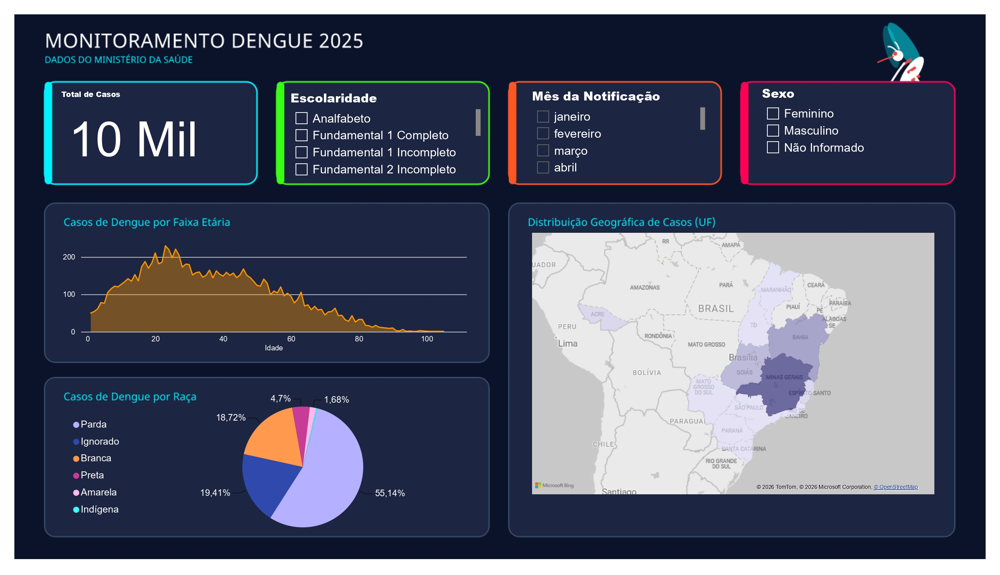

# Monitoramento de Dengue 2025 - Ministério da Saúde

Este projeto consiste em um pipeline completo de Engenharia e Visualização de Dados (ETL) que consome dados oficiais de notificações de Dengue diretamente da API pública do Ministério da Saúde, realiza o tratamento do volume de dados utilizando **Python** e consolida as análises em um dashboard interativo no **Power BI**.



---

## Tecnologias e Ferramentas Utilizadas
* **Python**: Extração estruturada (API REST), paginação dinâmica, tratamento de tipos e tratamento de erros.
* **Pandas**: Manipulação e exportação para CSV.
* **Requests**: Consumo da API HTTP.
* **Power BI & Power Query**: Modelagem de dados, linguagem M e desenvolvimento de relatórios interativos.

---

## Arquitetura do Projeto

### 1. Desafio da API & Solução com Python (Engenharia de Dados)
A API de Dados Abertos da Saúde do Governo Federal possui uma restrição severa de infraestrutura: **o parâmetro de limite máximo de registros por requisição é fixado em 20 itens**.

Para criar um conjunto de dados estatisticamente relevante (5.000+ registros), a atualização direta via Power BI seria lenta e ineficiente. A solução foi criar um pipeline em Python em `src/extracao_api.py` contendo:
* **Loop de Paginação Dinâmica**: Utilização do parâmetro `offset` somando de 20 em 20 para varrer as páginas sequencialmente.
* **Condição de Parada Automatizada**: O script detecta quando a API retorna um payload vazio `[]` e encerra o processo de forma limpa, evitando requisições desnecessárias.
* **Tratamento de Exceções**: Verificação ativa de `status_code == 200` para garantir a resiliência do pipeline contra instabilidades nos servidores públicos.

### 2. ETL & Tratamento de Regras de Negócio (Pandas & Power Query)
* **Cálculo de Idade Dinâmica (Linguagem M)**: No Power Query, desenvolvemos colunas calculadas para encontrar a idade dos pacientes cruzando o ano de nascimento com o ano dos dados (`2025`) usando a fórmula:
  ```powerquery
  2025 - [Ano_Nascimento]

### 3. Como Executar e Reproduzir o Projeto
Como o arquivo final de dados está sob políticas de .gitignore, siga o passo a passo abaixo para reproduzir o ambiente localmente:

 **Clonar o Repositório:**
* git clone (https://github.com/hiagodearaujodantasteixeira/Projeto-Dengue.git)
  
 **Instalar Dependências:**
* pip install pandas
* pip install requets
  
 **Executar a Extração Python:**
* Execute o script para gerar a base consolidada contendo os 5.000 registros de 2025:
* python src/extracao_api.py

 **Carregar no Power BI**:

* Abra o arquivo .pbix localizado na raiz do projeto.

* Vá em Transformar Dados (Power Query) e atualize o parâmetro de caminho local para apontar para o seu arquivo .csv recém-gerado.

* Clique em Fechar e Aplicar para atualizar todos os gráficos automaticamente.

### Dashboard no PowerBi Service
https://app.powerbi.com/view?r=eyJrIjoiNDRhNjNhY2YtNjk5MC00ODc0LTk2ZDQtMDNkM2Y5ZjRmYzlhIiwidCI6ImUyNjUzOTI3LTk3MjgtNDFjZC04Y2QzLWFiMTI4YWNkMjA2MSJ9
